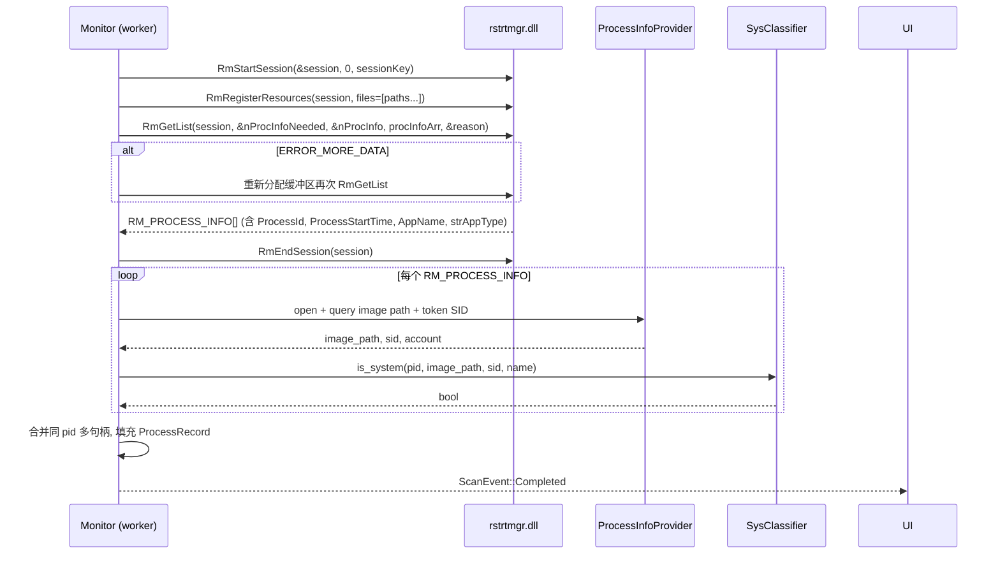

# 设计文档（Design Document）

## Overview

File_Lock_Inspector 是一款 Windows 10/11 桌面工具，使用 **Rust + eframe/egui** 构建为单一原生可执行文件。其核心能力是：通过 **Restart Manager API**（`rstrtmgr.dll`）查询任意文件/文件夹被哪些进程占用，并以固定周期持续刷新；对非系统进程提供"强制结束"按钮；对系统关键进程进行多维度识别并禁止结束；权限不足时引导用户以管理员身份重启。

设计的核心约束：

- **单一进程、单一可执行文件**：无外部依赖（不调用 handle.exe、不打包 sysinternals）。
- **响应性**：UI 主线程不可被 Restart Manager 调用阻塞。所有占用检测在后台 worker 线程中进行，结果通过 channel 回送主线程。
- **稳定性优先于功能**：系统进程黑名单 + 进程路径 + 进程令牌 SID 三重判定，宁可误判为系统进程也不可误结束系统进程。
- **可观测性**：所有底层 Win32 调用失败、强制结束失败、轮询异常都进入按日轮转的本地日志文件。

## Architecture

### 总体分层

```mermaid
flowchart TB
    subgraph UI["UI Layer (egui main thread)"]
        UIComp[Components: TargetListView / ProcessRow / ConfirmDialog / StatusBar]
        UIState[AppState: Target_List, settings, privilege]
    end

    subgraph Engine["Monitor Engine (worker thread)"]
        Scheduler[Scheduler: Polling_Interval ticker]
        Dispatcher[Per-Target task dispatcher]
    end

    subgraph Detect["Detection & Process Layer"]
        LD[Lock_Detector\nRestart Manager wrapper]
        PIP[Process_Info_Provider\nOpenProcess + QueryFullProcessImageName + Token SID]
        SPC[System_Process_Classifier\n黑名单 + 路径 + SID]
    end

    subgraph Ops["Action Layer"]
        TERM[Force_Terminator\nOpenProcess + TerminateProcess]
        ELEV[Elevation_Helper\nShellExecuteW runas]
    end

    subgraph Infra["Infrastructure"]
        LOG[Logger\ntracing + tracing-appender]
        CFG[Config\nPolling_Interval, window state]
    end

    UI -->|user actions| Engine
    Engine -->|RmGetList| LD
    LD --> PIP
    PIP --> SPC
    Engine -->|ScanResult via channel| UI
    UI -->|terminate(pid)| TERM
    UI -->|relaunch as admin| ELEV
    UI --> LOG
    Engine --> LOG
    Detect --> LOG
```

### 模块职责

| 模块 | 职责 | 线程归属 |
|------|------|----------|
| `ui` | egui 渲染、事件处理、状态展示、对话框、拖放接收 | 主线程（eframe） |
| `app_state` | 集中式应用状态（Target_List、设置、最近一次扫描结果快照） | 主线程，持有 `Arc<Mutex<...>>` 在线程间共享 |
| `monitor` | 调度器：按 Polling_Interval tick，分发扫描任务，避免对同一 target 并发 | 后台 worker 线程 |
| `detector` | Restart Manager 调用封装，输出 `Vec<ProcessRecord>` | 后台 worker 线程 |
| `process_info` | OpenProcess + QueryFullProcessImageNameW + token SID 查询 | 后台 worker 线程 |
| `sys_classifier` | 系统进程判定：黑名单 ∪（路径 ∩ 系统 SID） | 后台 worker 线程（纯函数） |
| `terminator` | OpenProcess(PROCESS_TERMINATE) + TerminateProcess | 由主线程触发，在专用短生命线程中执行（带 5s 超时） |
| `elevation` | 当前 token 提权状态查询；ShellExecuteW + "runas" 自我重启 | 主线程 |
| `logging` | tracing 初始化，tracing-appender daily rotation | 全局 |
| `config` | Polling_Interval、窗口尺寸、最近列表的持久化（serde + JSON） | 主线程 |

### 线程模型

- **UI 主线程**：运行 `eframe::run_native`，仅做 60 FPS 重绘 + 事件处理。绝不直接调用 Restart Manager。
- **Monitor 线程**：使用 `std::thread::spawn`（不引入 tokio 运行时，因为 Restart Manager 是阻塞同步 Win32 API，async 收益有限），内部一个循环 + `crossbeam_channel::select!` 等待 tick / 命令。
- **通道协议**：
  - `cmd_tx: Sender<MonitorCmd>`：主线程→Monitor，命令包括 `AddTarget(path)` / `RemoveTarget(id)` / `SetInterval(ms)` / `TriggerImmediate(id)` / `Shutdown`。
  - `result_tx: Sender<ScanEvent>`：Monitor→主线程，事件包括 `ScanStarted(id)` / `ScanCompleted(id, Vec<ProcessRecord>)` / `ScanFailed(id, Reason)`。
  - 主线程在每帧 `update()` 中非阻塞 `try_recv` 排空所有 ScanEvent 应用到 AppState，然后请求 `ctx.request_repaint_after(...)`。

### 防止重叠扫描

Monitor 维护 `HashSet<TargetId> in_flight`。当 tick 触发时，仅对不在 `in_flight` 中的 target 提交扫描任务（提交进入一个有界 `rayon` 线程池或简单的 `n=4` worker pool）。需求 3.6/3.7：扫描超时则下一轮等待，不累积排队。

## Components and Interfaces

### 技术栈与依赖（`Cargo.toml`）

```toml
[package]
name = "file-lock-inspector"
version = "0.1.0"
edition = "2021"

[dependencies]
# UI
eframe = { version = "0.28", default-features = false, features = ["default_fonts", "glow", "persistence"] }
egui = "0.28"
egui_extras = { version = "0.28", features = ["all_loaders"] }

# 文件对话框（egui 自身不带原生对话框）
rfd = "0.14"

# Win32 绑定
windows = { version = "0.58", features = [
    "Win32_Foundation",
    "Win32_Security",
    "Win32_System_Threading",
    "Win32_System_ProcessStatus",
    "Win32_System_RestartManager",
    "Win32_UI_Shell",
    "Win32_Storage_FileSystem",
] }

# 通道与并发
crossbeam-channel = "0.5"

# 序列化（用于配置持久化）
serde = { version = "1", features = ["derive"] }
serde_json = "1"

# 日志
tracing = "0.1"
tracing-subscriber = { version = "0.3", features = ["env-filter"] }
tracing-appender = "0.2"

# 错误处理
thiserror = "1"
anyhow = "1"

# 其他
once_cell = "1"
dirs = "5"  # 定位 %LOCALAPPDATA%

[build-dependencies]
embed-resource = "2"   # 嵌入 manifest（DPI Aware、common controls v6）

[profile.release]
opt-level = 3
lto = "thin"
codegen-units = 1
strip = "symbols"
```

构建时通过 `build.rs` + Windows manifest 启用 Per-Monitor V2 DPI、`requestedExecutionLevel level="asInvoker"`（默认非提权，由用户主动点击"以管理员身份重启"触发 UAC）。

### 文件结构

```
file-lock-inspector/
├── Cargo.toml
├── build.rs
├── resources/
│   ├── app.manifest          # DPI / executionLevel
│   └── app.ico
└── src/
    ├── main.rs               # 入口，初始化 logging、加载 config、启动 eframe
    ├── app.rs                # FileLockInspectorApp impl eframe::App
    ├── ui/
    │   ├── mod.rs
    │   ├── target_list.rs    # 左/中部目标项列表
    │   ├── process_row.rs    # 单条 ProcessRecord 行（强制结束按钮 / 系统进程徽标）
    │   ├── status_bar.rs     # 底部：权限状态 + 提权按钮 + 间隔下拉
    │   ├── dialogs.rs        # 二次确认 / 错误提示
    │   └── dropping.rs       # 拖放接收（egui RawInput::dropped_files）
    ├── state/
    │   ├── mod.rs
    │   ├── app_state.rs      # Arc<Mutex<AppState>>
    │   └── target.rs         # TargetItem / TargetId / TargetStatus
    ├── monitor/
    │   ├── mod.rs            # MonitorEngine + 命令/事件枚举
    │   └── scheduler.rs      # tick 循环 + in_flight 集合
    ├── detector/
    │   ├── mod.rs            # pub fn scan(path: &Path) -> Result<Vec<ProcessRecord>>
    │   └── restart_manager.rs # RmStartSession / RmRegisterResources / RmGetList 封装
    ├── process_info/
    │   ├── mod.rs            # ProcessInfoProvider
    │   └── token.rs          # 进程令牌 SID 查询
    ├── sys_classifier/
    │   ├── mod.rs            # is_system_process(record) -> bool
    │   └── blacklist.rs      # 静态黑名单常量
    ├── terminator.rs         # force_terminate(pid) -> Result<()>
    ├── elevation.rs          # is_elevated(), restart_as_admin()
    ├── config.rs             # AppConfig 持久化
    ├── logging.rs            # tracing 初始化
    └── error.rs              # AppError thiserror enum
```

## Data Models

```rust
// state/target.rs
#[derive(Clone, Copy, Debug, Eq, PartialEq, Hash, serde::Serialize, serde::Deserialize)]
pub struct TargetId(pub u64);

#[derive(Clone, Debug)]
pub struct TargetItem {
    pub id: TargetId,
    pub path: PathBuf,
    pub kind: TargetKind,            // File / Directory
    pub status: TargetStatus,
    pub processes: Vec<ProcessRecord>,
    pub last_scanned_at: Option<Instant>,
}

#[derive(Clone, Debug)]
pub enum TargetStatus {
    Pending,        // 刚加入，尚未首次扫描
    Scanning,
    Idle,           // 未被占用
    Locked { count: usize },
    Failed { reason: String },
    AccessDenied,   // 需要管理员
}

// detector/mod.rs
#[derive(Clone, Debug)]
pub struct ProcessRecord {
    pub pid: u32,
    pub name: String,                // e.g. "notepad.exe"
    pub image_path: Option<PathBuf>, // 可执行文件全路径
    pub locked_subpath: Option<PathBuf>, // 文件夹模式下展示其中一个被占用的子项
    pub locked_subitem_count: u32,   // 同 PID 在本次扫描中命中的资源条目数（≥ 1）
    pub start_time: Option<i64>,     // 进程启动时间（用于 PID 复用防御）
    pub app_type: AppType,           // 直接来自 RM strAppType
    pub is_system: bool,             // 由 sys_classifier 写入
    pub user_sid: Option<String>,    // 形如 "S-1-5-18"
    pub user_account: Option<String>,// "NT AUTHORITY\\SYSTEM"
}

#[derive(Clone, Copy, Debug)]
pub enum AppType {
    Application,
    Service,
    Console,
    Critical,
    Unknown,
}

// state/app_state.rs
pub struct AppState {
    pub targets: BTreeMap<TargetId, TargetItem>,
    pub next_id: u64,
    pub polling_interval_ms: u32,    // 1000 / 2000 / 5000 / 10000
    pub privilege: PrivilegeLevel,   // Standard / Elevated
    pub windows_supported: bool,
    pub last_error: Option<UiToast>, // 一次性提示
}

// monitor/mod.rs
pub enum MonitorCmd {
    AddTarget { id: TargetId, path: PathBuf, kind: TargetKind },
    RemoveTarget(TargetId),
    SetInterval(u32),
    TriggerImmediate(TargetId),
    Shutdown,
}

pub enum ScanEvent {
    Started(TargetId),
    Completed(TargetId, Vec<ProcessRecord>),
    Failed(TargetId, ScanFailure),
}

pub enum ScanFailure {
    AccessDenied,
    Other(String),
}
```

## Restart Manager 调用流程

Restart Manager 是 Windows Vista+ 标准化的"哪些进程占用了文件"查询接口，被 MSI installer 用于决定重启策略。它返回的进程列表包含 PID、ProcessStartTime、应用类型、应用名等，无需 SeDebugPrivilege，标准用户即可对自己持有的句柄进行查询；对系统服务持有的句柄返回受限信息（仍能给出 PID）。

### 单次扫描时序



### 关键调用要点

- **RM_SESSION_KEY 必须长度为 `CCH_RM_SESSION_KEY+1`（即 33）字符的 wide 缓冲区**，由 RmStartSession 写入，后续 RmRegisterResources/RmGetList 依赖该 session handle，不直接传 key。
- **RmRegisterResources 一次注册多文件**：对于单个文件的 Target_Item，注册 1 个；对于文件夹 Target_Item，注册顺序为「文件夹自身 + 直接子文件 + 直接子文件夹」（需求 1.7），最大注册数受制于 RmRegisterResources 内部限制（实测可注册数千），若一次目录子项过多则分批注册并合并 RmGetList 结果。
- **RmGetList 双调用模式**：第一次传 `nProcInfo=0` 获取 `nProcInfoNeeded`，分配缓冲区后再次调用；典型返回码 `ERROR_MORE_DATA` 时循环扩容（最多重试 3 次防止 TOCTOU 抖动）。
- **locked_subitem_count 语义**：Restart Manager 不直接给出"句柄数"。对单文件目标始终为 1；对文件夹目标，若同一 PID 在多次分批扫描结果中被多个子路径命中，则按命中条目数累加。这反映"该进程占用了 N 个子项"，**不**等同于 OS 句柄数（需求 2.3 已澄清此点）。
- **app_type 直通**：RM 返回的 `strAppType ∈ {RmUnknownApp, RmMainWindow, RmOtherWindow, RmService, RmExplorer, RmConsole, RmCritical}` 折叠为 `AppType` 五个变体。`RmCritical` 是 RM 自身已识别的关键进程，分类器中作为 Layer 0 早返回 `is_system=true`。
- **ProcessStartTime 校验**：将其与 `OpenProcess(pid)` 后查询的 `GetProcessTimes` 进行比对，若不一致说明 PID 已复用，标记为 stale，跳过该记录避免误杀。

## 进程详细信息获取（Process_Info_Provider）

```rust
pub struct ProcessSnapshot {
    pub image_path: Option<PathBuf>,
    pub user_sid: Option<String>,
    pub user_account: Option<String>,
}

pub fn snapshot(pid: u32) -> Result<ProcessSnapshot, AppError> {
    // 1. OpenProcess with PROCESS_QUERY_LIMITED_INFORMATION (Vista+ 推荐，权限要求最低)
    let h = OpenProcess(PROCESS_QUERY_LIMITED_INFORMATION, false, pid)?;

    // 2. QueryFullProcessImageNameW(h, 0, buf, &mut len)
    let image_path = query_image_path(h).ok();

    // 3. OpenProcessToken(h, TOKEN_QUERY, &token) → GetTokenInformation(TokenUser)
    //    → ConvertSidToStringSidW + LookupAccountSidW
    let (sid, account) = query_token_user(h).unwrap_or((None, None));

    CloseHandle(h);
    Ok(ProcessSnapshot { image_path, user_sid: sid, user_account: account })
}
```

- 当 `OpenProcess` 因权限不足返回 `ERROR_ACCESS_DENIED` 时，`image_path` 与 SID 均填 `None`，UI 仍展示 PID 与 RM 提供的 `AppName`。这种情况通常意味着该进程是系统服务，分类器在缺少路径/SID 时会**保守地视为系统进程**（白名单从严）。
- `QueryFullProcessImageNameW` 比 `GetModuleFileNameExW` 更优：后者要求 `PROCESS_VM_READ`，对系统进程总是失败；前者只需 `PROCESS_QUERY_LIMITED_INFORMATION`。

## 系统进程判定算法（System_Process_Classifier）

需求 5.1/5.2 定义了三层判定。算法：

```
fn is_system_process(rec: &PartialRecord) -> bool {
    // Layer 1: 硬黑名单（PID + name 双匹配，name 比较使用 ASCII 大小写不敏感）
    if rec.pid == 0 || rec.pid == 4 { return true; }
    const BLACKLIST: &[&str] = &[
        "smss.exe", "csrss.exe", "wininit.exe", "winlogon.exe",
        "services.exe", "lsass.exe", "lsm.exe", "svchost.exe",
        "Registry", "MemCompression",
    ];
    if BLACKLIST.iter().any(|n| eq_ignore_ascii_case(n, &rec.name)) {
        return true;
    }

    // Layer 2: 路径 ∩ 系统 SID
    let well_known_sids = ["S-1-5-18", "S-1-5-19", "S-1-5-20"]; // SYSTEM/LocalSvc/NetworkSvc
    let sys_dirs = [windir.join("System32"), windir.join("SysWOW64")];
    let in_sys_dir = rec.image_path.as_ref()
        .map(|p| sys_dirs.iter().any(|d| p.starts_with(d)))
        .unwrap_or(false);
    let sys_account = rec.user_sid.as_deref()
        .map(|s| well_known_sids.contains(&s))
        .unwrap_or(false);
    if in_sys_dir && sys_account { return true; }

    // Layer 3: 信息缺失 → 保守
    if rec.image_path.is_none() && rec.user_sid.is_none() {
        return true;     // 拿不到信息的进程统一视为系统进程，禁止结束
    }

    false
}
```

该算法保证：**svchost.exe 永远在黑名单内**（用户决策点 2）。即便 svchost 被恶意软件伪造（不在 System32 目录），仍因名字命中黑名单被拒绝结束——这种情况由用户使用专业反恶意软件处置。

## 强制结束实现（Force_Terminator）

```rust
pub fn force_terminate(pid: u32, expected_start_time: Option<FILETIME>)
    -> Result<(), TerminateError>
{
    if pid == 0 || pid == 4 { return Err(TerminateError::SystemProtected); }

    let h = OpenProcess(PROCESS_TERMINATE | PROCESS_QUERY_LIMITED_INFORMATION,
                        false, pid)
        .map_err(|e| match e.code() {
            ERROR_ACCESS_DENIED => TerminateError::AccessDenied,
            ERROR_INVALID_PARAMETER => TerminateError::AlreadyExited,
            _ => TerminateError::Other(e),
        })?;

    // PID reuse 防御：对比启动时间
    if let Some(expected) = expected_start_time {
        let actual = get_process_start_time(h)?;
        if actual != expected { return Err(TerminateError::StalePid); }
    }

    if !TerminateProcess(h, 1).as_bool() {
        let err = unsafe { GetLastError() };
        CloseHandle(h);
        return Err(TerminateError::from_win32(err));
    }
    CloseHandle(h);
    Ok(())
}

#[derive(thiserror::Error, Debug)]
pub enum TerminateError {
    #[error("权限不足，请以管理员身份重启程序")]
    AccessDenied,
    #[error("进程已不存在")]
    AlreadyExited,
    #[error("PID 已复用，已忽略本次操作")]
    StalePid,
    #[error("系统进程禁止结束")]
    SystemProtected,
    #[error("Windows 错误 {code}: {desc}")]
    Win32 { code: u32, desc: String },
    #[error(transparent)]
    Other(#[from] windows::core::Error),
}
```

- `force_terminate` 在专用短生命线程中执行（避免主线程被杀毒钩子阻塞），UI 主线程通过 `oneshot` channel 等待结果，超过 5000ms（需求 4.4）则超时丢弃 channel 并显示"操作超时"，已 spawn 的线程自然结束。
- 调用成功后立刻向 Monitor 发送 `TriggerImmediate(target_id)`（需求 4.5：1000ms 内刷新；实际 < 100ms）。
- `AccessDenied` 触发 UI Toast：『权限不足，请以管理员身份重启程序』 + 提权按钮（需求 4.6）。
- `AlreadyExited` 视为成功（需求 4.7），仍触发刷新。

## 拖放实现

egui 内建 `ctx.input(|i| i.raw.dropped_files.clone())`：每帧检查 `RawInput::dropped_files`，每个 `DroppedFile { path: Option<PathBuf>, .. }` 对应一个被拖入的项。在 `app.rs` 的 `update()` 起始处统一处理：

```rust
let dropped = ctx.input(|i| i.raw.dropped_files.clone());
for f in dropped {
    if let Some(p) = f.path {
        self.try_add_target(p);  // 内部做存在性 / 重复性校验（需求 1.4-1.6）
    }
}
```

附加视觉反馈：当 `i.raw.hovered_files` 非空时，在窗口上方覆盖一层半透明遮罩 + 提示文字"松开以添加"。

## 管理员重启（Elevation_Helper）

```rust
pub fn is_elevated() -> bool {
    // OpenProcessToken + GetTokenInformation(TokenElevation)
}

pub fn restart_as_admin() -> Result<(), AppError> {
    let exe = std::env::current_exe()?;
    let exe_w: Vec<u16> = exe.as_os_str().encode_wide().chain([0]).collect();
    let verb_w: Vec<u16> = "runas\0".encode_utf16().collect();
    let info = SHELLEXECUTEINFOW {
        cbSize: size_of::<SHELLEXECUTEINFOW>() as u32,
        fMask: SEE_MASK_NOCLOSEPROCESS,
        lpVerb: PCWSTR(verb_w.as_ptr()),
        lpFile: PCWSTR(exe_w.as_ptr()),
        nShow: SW_SHOWNORMAL.0,
        ..Default::default()
    };
    if !ShellExecuteExW(&mut info).as_bool() {
        let err = unsafe { GetLastError() };
        if err == ERROR_CANCELLED { return Ok(()); } // 用户拒绝 UAC，不算错误（需求 6.4）
        return Err(AppError::Win32(err));
    }
    // 启动成功，发出退出请求让 eframe 优雅关窗
    Err(AppError::SelfExit)  // 由 main 捕获并 std::process::exit(0)
}
```

## 日志策略

- 库：`tracing` + `tracing-subscriber` + `tracing-appender`
- 目录：`%LOCALAPPDATA%\FileLockInspector\logs`（用 `dirs::data_local_dir()` 拼接）
- 滚动：`tracing_appender::rolling::daily(dir, "fli.log")`，文件名形如 `fli.log.2025-01-30`
- 单文件大小：tracing-appender 的日轮转不直接限制大小，但额外用一个后台任务在每次启动时扫描并删除 30 天前的文件以及超过 10MB 的当日文件（截断为新文件，需求 8.2）。
- 级别：默认 `info`，通过环境变量 `FLI_LOG=debug` 可调高
- 日志事件类别：
  - `target_added` / `target_removed`
  - `scan_completed`（target_id, n_processes, duration_ms）
  - `scan_failed`（target_id, error）
  - `terminate_attempt`（pid, name, result）
  - `elevation`（success / cancelled / failed）
  - `panic_hook`：通过 `std::panic::set_hook` 把 panic 信息也写入日志
- UI 入口"打开日志目录"调用 `windows::Win32::UI::Shell::ShellExecuteW(verb=open, file=log_dir)`。

## 配置与持久化

- 配置文件 `%LOCALAPPDATA%\FileLockInspector\config.json`
- 字段：`polling_interval_ms`、`window_size`、`window_pos`、可选 `recent_targets: Vec<PathBuf>`
- 在 `eframe::App::save` 中持久化（eframe 自带 `persistence` feature）。
- 注意：Target_List 内容**不**默认持久化（每次启动空白），避免上次列表里的失效路径产生噪声；用户如需保留可在设置中勾选。

## UI 布局（egui）

```
+-------------------------------------------------------------+
|  File Lock Inspector                       [_][▢][X]        |
+-------------------------------------------------------------+
| [+ 添加文件] [+ 添加文件夹] [清空列表] [打开日志目录]  | 间隔: ▼ 2000ms
+-------------------------------------------------------------+
|  Target_Item 列表（可拖放区域，空时显示拖放提示）            |
|  ▸ C:\path\to\file.docx  · 状态: 被占用 (2 个进程)           |
|     ├─ WINWORD.EXE [PID 1234] 用户进程  [强制结束]           |
|     └─ explorer.exe [PID 5678] 用户进程  [强制结束]          |
|  ▸ C:\path\to\folder\    · 状态: 被占用 (1 个进程)           |
|     └─ svchost.exe [PID 880] 系统进程，请手动处理 [查看建议] |
|  ▸ D:\readme.md          · 状态: 未被占用                    |
+-------------------------------------------------------------+
| 当前权限: 标准用户   [以管理员身份重启]                      |
+-------------------------------------------------------------+
```

- 主面板使用 `egui::CentralPanel` + `ScrollArea::vertical`
- 顶部工具栏：`egui::TopBottomPanel::top`
- 底部状态栏：`egui::TopBottomPanel::bottom`
- 二次确认与错误提示：`egui::Window` 居中模态（egui 没有真正的模态，使用 `Modal`-style 自定义组件 + `id_salt` 单实例）
- 配色：使用 egui 默认深色主题；clickable 元素带 `cursor=PointingHand`；强制结束按钮使用警告色 `Color32::from_rgb(0xD9, 0x3A, 0x3A)`，hover 颜色加深 10%；hover 不使用缩放变换避免布局抖动

## Correctness Properties

*A property is a characteristic or behavior that should hold true across all valid executions of a system—essentially, a formal statement about what the system should do. Properties serve as the bridge between human-readable specifications and machine-verifiable correctness guarantees.*

本应用核心逻辑（状态机、调度器、判定器、错误映射）为纯函数或可 mock 的同步逻辑，适合属性化测试。涉及 Win32 副作用的部分（实际 RmGetList、TerminateProcess、ShellExecuteW）则使用 trait 抽象 + mock 实现注入，把"调用契约"作为属性表达。

### Property 1: try_add_target 的输入归并语义

*For any* 路径列表 `inputs: Vec<PathBuf>` 和初始 `Target_List = ∅`，依次调用 `try_add_target` 后，最终 `Target_List` 中的路径集合等于 `dedup(inputs.filter(|p| p.exists()))`，即"输入去重 ∩ 真实存在"。

**Validates: Requirements 1.3, 1.4, 1.5, 1.6, 1.9**

### Property 2: 文件夹仅枚举直接子项

*For any* 随机生成的目录树（深度 ≥ 2，节点数 ≥ 0），对其根调用 `enumerate_targets_for_folder(root)`，返回的路径集合 `S` 满足：`{root} ⊆ S`、`S \ {root}` 全部是 `root` 的直接子项（深度恰好为 1），且 `S` 不包含任何深度 ≥ 2 的路径。

**Validates: Requirements 1.7**

### Property 3: ProcessRecord 合并不变量

*For any* mock RM 返回的 `Vec<RM_PROCESS_INFO>`（同一 PID 可重复出现），`Lock_Detector` 输出的 `Vec<ProcessRecord>` 满足：(a) 所有 `record.pid` 互不相同；(b) `Σ record.locked_subitem_count == 输入条目数`；(c) 文件夹模式下每条 `record.locked_subpath` ∈ 注册过的资源路径集合。

**Validates: Requirements 2.2, 2.3, 2.4**

### Property 4: 周期轮询频率

*For any* `interval ∈ {1000,2000,5000,10000} ms`、`N` 个 target、观察时长 `T ≥ 3·interval` 的 mock 时钟下，每个 target 收到的 `ScanEvent::Started` 数量 `n` 满足 `|n − T/interval| ≤ 1`。

**Validates: Requirements 3.1, 3.2, 3.3**

### Property 5: AppState 反映最新扫描结果（状态机一致性）

*For any* `target_id` 上任意 mock 扫描结果序列 `[r₀, r₁, …, rₖ]`，依次将 `ScanEvent::Completed(target_id, rᵢ)` apply 到 AppState 之后，`state.targets[target_id].processes == rₖ`，且当 `rₖ.is_empty()` 时 `status == Idle`，否则 `status == Locked { count: rₖ.len() }`。

**Validates: Requirements 3.5, 3.6**

### Property 6: 同 target 不并发扫描（in_flight 不变量）

*For any* `MonitorCmd` 与 tick 事件的任意交错调度序列下，调度器在任意时刻对同一 `target_id` 同时活跃的扫描任务数始终 ≤ 1；且当某次扫描耗时超过 `Polling_Interval` 时，超时窗口内不会为该 target 提交额外任务（不累积排队）。

**Validates: Requirements 3.7, 3.8**

### Property 7: 终止操作的错误码映射

*For any* `OpenProcess`/`TerminateProcess` 的 mock 返回错误码 `e ∈ Win32 错误码`，`force_terminate` 返回的 `TerminateError` 满足以下双射：`ERROR_ACCESS_DENIED → AccessDenied`、`ERROR_INVALID_PARAMETER → AlreadyExited`、其他 → `Win32 { code: e, desc: format_message(e) }`，且最终 UI 错误消息字符串包含 `format!("0x{:08X}", e)`。

**Validates: Requirements 4.6, 4.7, 4.8**

### Property 8: 系统进程判定算法

*For any* `(name, pid, sid, image_path)` 元组，`is_system_process` 返回 `true` 当且仅当至少一个条件成立：(a) `pid ∈ {0, 4}`；(b) `name` 属于硬编码黑名单（大小写不敏感）；(c) `sid ∈ {S-1-5-18, S-1-5-19, S-1-5-20}` 且 `image_path` 在 `%WINDIR%\System32` 或 `%WINDIR%\SysWOW64` 之下；(d) `image_path` 与 `sid` 同时缺失（信息不可获取保守判定）。

**Validates: Requirements 5.1, 5.2**

### Property 9: 系统进程的 UI 与终止保护

*For any* `ProcessRecord r` 满足 `r.is_system == true`，UI 渲染输出不包含"强制结束"按钮 widget，包含"系统进程"标识与"查看处理建议"链接；且对任意调用 `force_terminate(r.pid, …)` 返回 `TerminateError::SystemProtected`，**不调用** mock 的 `TerminateProcess`。

**Validates: Requirements 5.3, 5.4, 5.5**

### Property 10: 列表移除/清空的最终状态

*For any* `AppState s` 与 `id` / 全部清空命令，`apply(RemoveTarget(id), s).targets` 不含 `id`，`apply(ClearAll, s).targets.is_empty()`，且这些命令是幂等的：`apply(c, apply(c, s)) == apply(c, s)`。

**Validates: Requirements 7.1, 7.3**

### Property 11: 空列表暂停轮询

*For any* 命令序列 `cmds` 使得最终 `state.targets.is_empty()`，在该最终状态下任意数量的 tick 事件触发的扫描任务总数为 0。

**Validates: Requirements 7.4**

### Property 12: 取消操作的状态恒等

*For any* `AppState s` 与处于二次确认对话框中的待终止 `pid`，用户点击"取消"后 `state == s`（包括 targets、processes、settings 完全相等）。

**Validates: Requirements 4.9**

### Property 13: 批量添加结果的聚合

*For any* 单次批量添加（拖放或多选对话框）输入的路径列表 `inputs`，UI_Layer 仅产生**一个** Toast，且其文案严格满足模板 `"成功添加 {X} 项 / 跳过 {Y} 项已存在 / 拒绝 {Z} 项不存在"`，其中 `X+Y+Z == inputs.len()` 且三者均与 `try_add_target` 的结果分类一致。

**Validates: Requirements 1.5, 1.6, 1.9**

### Property 14: Polling_Interval 切换不打断当前轮询

*For any* `(t₀ 进行中的扫描, SetInterval(new_interval))` 序列，`SetInterval` 命令既不取消正在进行的扫描，也不在当前轮询完成前发起新轮询；新间隔从当前轮询结束时刻起开始计时。

**Validates: Requirements 3.4**

## Error Handling

### 错误分类

```rust
#[derive(thiserror::Error, Debug)]
pub enum AppError {
    #[error("Win32 错误 0x{0:08X}: {1}")]
    Win32(u32, String),

    #[error("Restart Manager 调用失败: {0}")]
    RestartManager(#[from] RmError),

    #[error("路径不存在: {0}")]
    PathNotFound(PathBuf),

    #[error("权限不足，需要管理员")]
    AccessDenied,

    #[error("当前 Windows 版本不受支持")]
    UnsupportedOs,

    #[error("内部错误: {0}")]
    Internal(String),

    #[error("自重启请求")]
    SelfExit,
}
```

### 边界场景与处置

| 场景 | 触发条件 | 处置 |
|------|----------|------|
| 路径在两次扫描间被删除 | 文件已不存在 | RM 返回空列表，target 状态 → `Idle`，UI 显示"文件已不存在"提示并允许用户从列表移除 |
| PID 复用 | TerminateProcess 时启动时间不匹配 | 返回 `StalePid`，记录日志，触发立即刷新，不杀错进程 |
| 进程在二次确认期间已退出 | 终止时 `OpenProcess` 返回 `ERROR_INVALID_PARAMETER` | 视为成功（需求 4.7） |
| TerminateProcess 调用挂起 | 杀毒软件钩子 / 内核驱动阻塞 | 5000ms 超时（需求 4.4），UI 显示"操作超时，请重试"，已 spawn 的终止线程自然结束 |
| 大量子项的文件夹（>10k） | 注册资源数过大 | 分批 RmRegisterResources，每批 ≤ 1000 个；总耗时 > polling_interval 时按需求 3.7 不累积排队 |
| 网络盘 / OneDrive 占位文件 | 路径存在但文件为占位 | 仍可注册到 RM，行为正常；占用列表可能为空 |
| Windows 版本 < 10.1809 | `RtlGetVersion` 检查 | 启动时 UI Toast 提示"系统版本不受支持"，但允许继续运行（需求 9.5） |
| 日志写入失败（磁盘满） | tracing-appender 错误 | 全局 panic hook 捕获，UI Toast 一次性提示，写入回退到 stderr，不崩溃（需求 8.4） |
| UAC 拒绝 | ShellExecuteExW → `ERROR_CANCELLED` | 当前进程继续运行，无错误提示（需求 6.4） |
| egui 主线程 panic | 任何 unwrap 失败 | `std::panic::set_hook` 写日志，eframe 自动展示崩溃窗口（不增加自定义恢复） |

### 错误传播原则

- **底层 Win32 调用** 全部返回 `windows::core::Result`，转换为 `AppError::Win32(code, message)`，其中 `message` 通过 `FormatMessageW` 获取本地化描述。
- **后台线程错误** 通过 `ScanEvent::Failed` 回送 UI；UI 在该 target 上显示状态而不弹全局错误。
- **致命错误**（如 RM 库无法加载）：进入"安全模式"——禁用扫描功能但不退出，让用户看到日志按钮。

## Testing Strategy

### 测试矩阵

| 测试类型 | 工具 | 覆盖目标 |
|----------|------|----------|
| 属性测试（PBT） | `proptest` | Properties 1–12（纯逻辑模块） |
| 单元测试 | `cargo test` 内建 | 错误码映射、字符串格式化、单条 EXAMPLE 类型用例 |
| 集成测试 | `cargo test --test integration_*` | 真实文件系统下的 detector + monitor 端到端 |
| 快照测试 | `insta` | UI 渲染快照（egui 通过虚拟离屏渲染） |
| 烟囱（Smoke）测试 | 手动 + 一次性脚本 | OS 对话框、ShellExecute、构建产物 |

### 属性测试约定

- **库**：`proptest` v1.x
- **迭代次数**：每个属性 ≥ 100（默认 256，可通过 `PROPTEST_CASES` 覆盖）
- **生成器约定**：
  - `PathBuf`：使用 `proptest::path::PathParams` 配合 tempdir 创建真实文件
  - 目录树：递归生成 `Tree { name, children: Vec<Tree> }`，深度 ≤ 5，节点数 ≤ 50
  - `RM_PROCESS_INFO`：自定义 `Strategy` 生成 PID（u32）、name（短 ASCII 字符串）、可选 image_path
  - Win32 错误码：从 `[ERROR_ACCESS_DENIED, ERROR_INVALID_PARAMETER, ERROR_FILE_NOT_FOUND, …]` 中选取，外加任意 u32
- **测试标签**：每个属性测试函数顶部注释格式：

```rust
// Feature: file-lock-inspector, Property 8: 系统进程判定算法
#[test]
fn prop_is_system_process_satisfies_definition() {
    proptest!(|(rec in arb_partial_record())| {
        prop_assert_eq!(is_system_process(&rec), expected_classification(&rec));
    });
}
```

### Mock 抽象

为了让 PBT 不依赖真实 Win32：

```rust
pub trait RestartManagerApi {
    fn scan(&self, paths: &[PathBuf]) -> Result<Vec<RmProcessInfo>, RmError>;
}
pub trait ProcessControlApi {
    fn open_terminate(&self, pid: u32) -> Result<TerminateHandle, Win32Error>;
    fn terminate(&self, h: &TerminateHandle, code: u32) -> Result<(), Win32Error>;
}
pub trait Clock {
    fn now(&self) -> Instant;
    fn sleep(&self, d: Duration);
}
```

- 生产实现：`Win32RestartManager`、`Win32ProcessControl`、`SystemClock`
- 测试实现：`MockRestartManager`（脚本化序列）、`MockProcessControl`、`FakeClock`（手动 advance）

### 单元/集成测试覆盖的 EXAMPLE 类用例

| 需求 | 用例 |
|------|------|
| 2.5 | mock RM 返回 ERROR_ACCESS_DENIED，断言 `target.status == AccessDenied` |
| 2.6 | mock RM panic，断言日志包含 `scan_failed` 事件 |
| 3.8 | RemoveTarget 后，下一个 tick 不再产出该 target 的 ScanEvent |
| 4.1 / 4.2 / 4.3 | UI 快照：non-system → 含"强制结束"按钮；点击后展示确认对话框 |
| 6.2 / 6.4 / 6.5 | 标准用户/管理员/UAC 拒绝三种状态下的 UI 快照 |
| 8.1 / 8.4 | 注入 panic 验证日志写入；mock IO 错误验证 toast 提示 |
| 9.5 | mock 版本号 < 10.0.17763 时启动产生 UnsupportedOs toast |

### 不进行属性测试的部分

- Win32 对话框（`GetOpenFileName` / `IFileDialog`）：由 OS 提供，烟囱测试即可
- ShellExecuteExW：副作用注入新进程，仅 mock 测试参数正确性
- 实际杀进程：CI 中不允许杀任意进程，仅在 mock 上验证参数与状态机
- egui 真实输入循环（鼠标点击坐标级别）：由 egui 自身已测试

### CI 与本地

- `cargo test --workspace` 运行所有 PBT + 单元 + 集成
- `cargo clippy --all-targets -- -D warnings`
- `cargo fmt --check`
- 仅 `windows-latest` runner（Linux/macOS 不构建，因 windows-rs Win32_System_RestartManager 平台限定）

## 关键设计决策与权衡

| 决策 | 选项 | 选择 | 理由 |
|------|------|------|------|
| UI 框架 | WinUI 3 / Tauri / egui / Slint | **egui** | Rust + WinUI3 集成不成熟（C++/WinRT 桥接复杂）；egui 是纯 Rust，单文件分发，开发节奏最快；牺牲：原生外观稍弱 |
| 占用查询 | handle.exe / NtQuerySystemInformation / Restart Manager | **Restart Manager** | 文档化、稳定、无需 SeDebugPrivilege；相比 NtQuerySystemInformation 不返回完整句柄但满足"哪些进程占用"语义；无外部 EXE 依赖 |
| 异步运行时 | tokio / 自管线程 | **std::thread + crossbeam-channel** | RM 为同步阻塞 API；引入 tokio 收益小且增加二进制体积约 2MB |
| Win32 绑定 | windows-sys / windows / winapi | **windows (0.58)** | RAII 句柄、`Result` 类型，比 windows-sys 更安全；winapi 已停止主要更新 |
| 系统进程白名单 | 仅黑名单 / 仅 SID / 黑名单+SID+路径 | **三重判定** | 单一规则易绕过或误伤；三重并集 + 信息缺失保守化最大化保护 |
| 持久化 Target_List | 自动保存 / 仅手动 / 不保存 | **不默认保存** | 列表中失效路径会让人迷惑；后续可作为可选项加入 |

## 待用户确认的开放点

> 以下技术细节在本设计中已给出方案，但若用户有偏好可在 Tasks 阶段调整：
> - egui 主题色（当前默认深色）；是否支持系统主题跟随
> - 是否需要快捷键（如 Ctrl+L 清空、F5 立即刷新）
> - "查看处理建议"链接的目标——内嵌弹窗还是打开 GitHub README
> - 是否打包安装器（MSI/MSIX）或仅分发独立 exe
