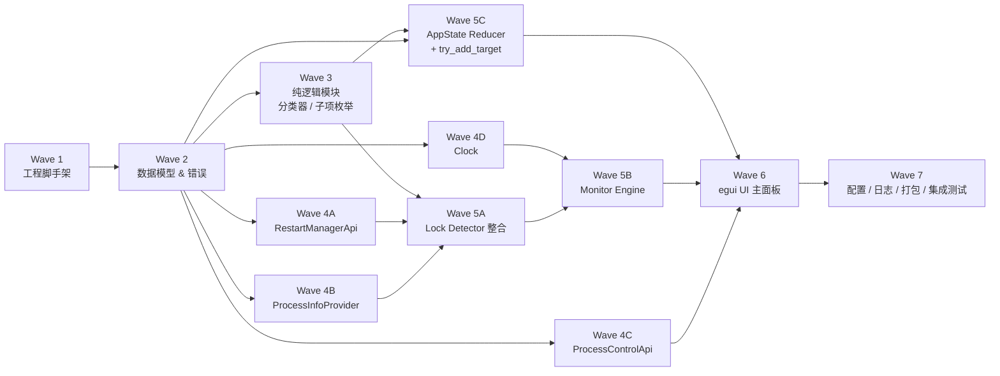

# 实施任务清单（Implementation Plan）：File_Lock_Inspector

## Overview

本文档把 design.md 中的架构与 12 条 Correctness Properties 拆解为可由代码生成代理逐一执行的叶任务。
所有任务按 **Wave（依赖层级）** 组织，从下向上构建：先纯逻辑与数据模型，再 Win32 封装与 Mock，再扫描/调度，最后 UI 与打包。

**原则**：

- 每个叶任务粒度控制在半天～一天，可独立交付
- 每条叶任务至少标注一个 `_Requirements: X.Y_` 和/或 `_Property: N_`，并通过 `_Depends on: Tx.y_` 显式声明前置任务
- 测试类（PBT / 单元测试 / 集成测试）一律使用 `*` 后缀标记为可选，便于 MVP 模式跳过
- 顶层任务（epic）不带 `*`
- PBT 任务全部针对纯逻辑或可 mock 的同步逻辑：`is_system_process`、`enumerate_direct_children`、`try_add_target`、`merge_process_records`、调度器 `apply`、AppState reducer、错误码映射等
- 三个核心 trait（`RestartManagerApi`、`ProcessControlApi`、`Clock`）必须先于使用方实现，并各自给出 `Win32*` 真实实现 + `Mock*`/`Fake*` 测试实现

## 实施 Wave 与依赖图

**依赖原则**：

- 同一 Wave 内的任务可并行
- 跨 Wave 任务必须按顺序
- 测试任务（带 `*`）依赖被测对象任务

---

## Tasks

### Wave 1：工程脚手架与依赖

- [x] 1. 初始化 Rust 工程与基础设施
  - [x] 1.1 创建 cargo 工程并写入 `Cargo.toml` 依赖清单
    - 按 design 4.1 节的依赖表写入：`eframe 0.28`、`egui 0.28`、`egui_extras`、`rfd 0.14`、`windows 0.58`（含 Foundation/Security/Threading/ProcessStatus/RestartManager/Shell/FileSystem 子特性）、`crossbeam-channel 0.5`、`serde`、`serde_json`、`tracing` 三件套、`thiserror`、`anyhow`、`once_cell`、`dirs 5`，build-dependencies 添加 `embed-resource 2`
    - 设置 `[profile.release]` 为 `opt-level=3 / lto="thin" / codegen-units=1 / strip="symbols"`
    - _Requirements: 9.1, 9.3_
    - _Depends on: —_
  - [x] 1.2 建立模块目录骨架
    - 按 design 4.2 节"文件结构"创建 `src/{ui,state,monitor,detector,process_info,sys_classifier}` 子目录与对应 `mod.rs`
    - 在每个 mod.rs 中导出占位 `pub use` 与空 struct，确保 `cargo check` 通过
    - _Requirements: 9.1_
    - _Depends on: 1.1_
  - [x] 1.3 编写 `build.rs` 嵌入 Windows manifest
    - `resources/app.manifest` 声明 `requestedExecutionLevel level="asInvoker"`、Per-Monitor V2 DPI、common controls v6
    - `build.rs` 调用 `embed_resource::compile`
    - _Requirements: 9.1, 9.4, 6.3_
    - _Depends on: 1.1_
  - [x] 1.4 实现 `logging.rs` 骨架与启动初始化
    - 用 `tracing-subscriber` + `tracing-appender::rolling::daily` 输出到 `%LOCALAPPDATA%\FileLockInspector\logs\fli.log.YYYY-MM-DD`
    - 默认级别 `info`，支持 `FLI_LOG=debug` 环境变量覆写
    - 注册 `std::panic::set_hook`，把 panic 信息写入日志
    - _Requirements: 8.1, 8.2_
    - _Depends on: 1.1_
  - [x] 1.5 实现 `main.rs` 与 `app.rs` 最小可运行框架
    - `main.rs` 调用 `logging::init`、加载 `AppConfig`（暂时返回默认）、启动 `eframe::run_native`
    - `FileLockInspectorApp` 实现 `eframe::App`，`update` 仅渲染一个空的 `CentralPanel`
    - 完成后 `cargo run` 应能弹出空白窗口
    - _Requirements: 9.1_
    - _Depends on: 1.2, 1.3, 1.4_

---

### Wave 2：数据模型与错误类型

- [x] 2. 定义核心数据结构与错误枚举
  - [x] 2.1 实现 `state/target.rs`：`TargetId`、`TargetKind`、`TargetStatus`、`TargetItem`
    - 严格按 design "Data Models" 节字段，`TargetId(pub u64)` 派生 `Copy/Eq/Hash/Serialize`
    - `TargetStatus` 枚举包含 `Pending / Scanning / Idle / Locked{count} / Failed{reason} / AccessDenied`
    - _Requirements: 7.5_
    - _Depends on: 1.2_
  - [x] 2.2 实现 `detector/mod.rs` 中的 `ProcessRecord` 与 `AppType`
    - 字段含 `pid / name / image_path / locked_subpath / locked_subitem_count / start_time / app_type / is_system / user_sid / user_account`
    - `AppType` 枚举：`Application / Service / Console / Critical / Unknown`，由 RM 的 `strAppType` 映射
    - _Requirements: 2.2, 2.3, 2.4, 2.7_
    - _Depends on: 1.2_
  - [x] 2.3 实现 `state/app_state.rs`：`AppState`、`PrivilegeLevel`、`UiToast`
    - `targets: BTreeMap<TargetId, TargetItem>`、`next_id`、`polling_interval_ms`、`privilege`、`windows_supported`、`last_error`
    - 提供 `AppState::new_default` 与 `next_id()` 自增方法
    - _Requirements: 3.2, 6.1, 9.5_
    - _Depends on: 2.1_
  - [x] 2.4 实现 `error.rs`：`AppError`、`TerminateError`、`ScanFailure`、`RmError`
    - 用 `thiserror` 定义 design "Error Handling" 节列出的全部错误变体
    - `AppError::Win32(u32, String)` 提供构造工具 `from_win32(code)`，内部用 `FormatMessageW` 取本地化描述
    - _Requirements: 4.5, 4.6, 4.7, 8.1_
    - _Depends on: 1.2_
  - [x] 2.5 数据模型与错误类型单元测试
    - 验证 `TargetStatus` 序列化、`PrivilegeLevel` 切换、`AppError` 的 Display 字符串包含 `0x{:08X}` 格式
    - _Requirements: 4.7, 8.1_
    - _Depends on: 2.1, 2.2, 2.3, 2.4_

---

### Wave 3：纯逻辑模块（分类器 / 子项枚举）

- [x] 3. 实现系统进程分类器与文件夹枚举工具
  - [x] 3.1 实现 `sys_classifier/blacklist.rs`：硬编码黑名单常量
    - `const BLACKLIST: &[&str]` 包含 smss/csrss/wininit/winlogon/services/lsass/lsm/svchost/Registry/MemCompression
    - 提供 `eq_ignore_ascii_case` 比对辅助函数
    - _Requirements: 5.1_
    - _Depends on: 1.2_
  - [x] 3.2 实现 `sys_classifier::is_system_process(rec: &PartialRecord) -> bool`
    - 三层判定：Layer1（PID 0/4 + 名字黑名单）∪ Layer2（系统 SID ∩ System32/SysWOW64 路径）∪ Layer3（image_path 与 sid 同时缺失）
    - `well_known_sids = ["S-1-5-18","S-1-5-19","S-1-5-20"]`
    - `windir` 通过 `std::env::var("WINDIR")` 取得（缺省回退 `C:\Windows`）
    - _Requirements: 5.1, 5.2_
    - _Depends on: 2.2, 3.1_
  - [x] 3.3 Property 8 PBT：系统进程判定算法
    - **Property 8: 系统进程判定算法**
    - **Validates: Requirements 5.1, 5.2**
    - 用 `proptest` 生成 `(name, pid, sid, image_path)` 元组，断言 `is_system_process` 与 design 中给出的等价定义完全一致
    - 至少 100 次迭代；标签：`Feature: file-lock-inspector, Property 8: 系统进程判定算法`
    - _Depends on: 3.2_
  - [x] 3.4 实现 `enumerate_direct_children(root: &Path) -> Vec<PathBuf>`
    - 返回 `[root]` ∪ `root` 的直接子文件 ∪ 直接子文件夹（深度恰好 = 1），不递归
    - 处理 `read_dir` 失败：吞掉具体子项错误并记录日志，返回至少包含 `root` 的列表
    - _Requirements: 1.7_
    - _Depends on: 1.2_
  - [x] 3.5 Property 2 PBT：文件夹仅枚举直接子项
    - **Property 2: 文件夹仅枚举直接子项**
    - **Validates: Requirements 1.7**
    - 在 tempdir 中递归生成深度 ≤ 5、节点 ≤ 50 的目录树；断言 `enumerate_direct_children(root)` 的结果集合 `S` 满足：`{root} ⊆ S`、`S\{root}` 全部为深度恰好 1 的子项、不含深度 ≥ 2 的路径
    - 至少 100 次迭代；标签：`Feature: file-lock-inspector, Property 2: 文件夹仅枚举直接子项`
    - _Depends on: 3.4_

---

### Wave 4A：Restart Manager 封装与 RestartManagerApi trait

- [x] 4. 封装 Restart Manager 调用并定义 trait
  - [x] 4.1 定义 `detector/restart_manager.rs` 中的 `RestartManagerApi` trait 与 DTO
    - `pub trait RestartManagerApi { fn scan(&self, paths: &[PathBuf]) -> Result<Vec<RmProcessInfo>, RmError>; }`
    - DTO `RmProcessInfo { pid: u32, start_time: Option<FILETIME>, app_name: String, app_type: u32 }`
    - 错误类型 `RmError`（已在 2.4 定义，此处仅 use）
    - _Requirements: 9.2_
    - _Depends on: 2.4_
  - [x] 4.2 实现真实 `Win32RestartManager`：RmStartSession + RmRegisterResources + RmGetList + RmEndSession 的安全包装
    - `session_key` 使用长度 33 的 wide buffer（`CCH_RM_SESSION_KEY+1`）
    - `RmGetList` 双调用模式：第一次 `nProcInfo=0` 取 `nProcInfoNeeded`；扩容后再调；遇 `ERROR_MORE_DATA` 最多重试 3 次
    - 资源数过大时分批 `RmRegisterResources`（每批 ≤ 1000）并合并 `RmGetList` 结果
    - RAII：`RmEndSession` 必须在 Drop 中调用以避免泄漏
    - _Requirements: 9.2, 9.3, 1.7_
    - _Depends on: 4.1_
  - [x] 4.3 实现 `MockRestartManager` 测试桩
    - 内部持 `Vec<Vec<RmProcessInfo>>` 脚本化序列；每次 `scan` 返回下一项
    - 支持注入 `RmError` 模拟失败（含 `AccessDenied`）
    - 暴露 `expectations()` 与 `with_responses(...)` 构造器供 PBT 与单测使用
    - _Requirements: 2.5, 2.6_
    - _Depends on: 4.1_
  - [x] 4.4 RestartManager 错误码映射单元测试
    - 验证 `ERROR_ACCESS_DENIED` → `RmError::AccessDenied`、`ERROR_FILE_NOT_FOUND` → `RmError::PathNotFound`、其他 → `RmError::Win32{code,desc}`
    - _Requirements: 2.5, 2.6_
    - _Depends on: 4.2_

---

### Wave 4B：ProcessInfoProvider

- [x] 5. 实现进程详细信息查询模块
  - [x] 5.1 实现 `process_info::snapshot(pid: u32) -> Result<ProcessSnapshot, AppError>`
    - `OpenProcess(PROCESS_QUERY_LIMITED_INFORMATION, false, pid)`
    - 调用 `QueryFullProcessImageNameW` 取 image path（不使用需要 PROCESS_VM_READ 的 `GetModuleFileNameExW`）
    - 失败时 image_path 字段填 `None`（不向上传播错误）
    - _Requirements: 2.2, 9.3_
    - _Depends on: 2.2, 2.4_
  - [x] 5.2 实现 `process_info/token.rs`：进程令牌 SID 与账户名查询
    - `OpenProcessToken(h, TOKEN_QUERY)` → `GetTokenInformation(TokenUser)` → `ConvertSidToStringSidW` + `LookupAccountSidW`
    - 返回 `(Option<String> sid, Option<String> "DOMAIN\\Account")`
    - 失败保守返回 `(None, None)`
    - _Requirements: 5.2_
    - _Depends on: 5.1_
  - [x] 5.3 ProcessInfoProvider 集成测试（标记 ignored，由开发者本地手动跑）
    - 用 `std::process::id()` 取本进程 PID，断言 `snapshot` 返回非空 image_path、SID 以 `S-1-5-21-` 开头（用户域 SID）
    - 标记 `#[ignore]` 避免 CI 跨账户失败
    - _Requirements: 2.2, 5.2_
    - _Depends on: 5.1, 5.2_

---

### Wave 4C：ProcessControlApi（强制结束 trait）

- [x] 6. 抽象进程终止接口
  - [x] 6.1 定义 `terminator.rs` 中的 `ProcessControlApi` trait
    - `fn open_terminate(&self, pid: u32) -> Result<TerminateHandle, Win32Error>`
    - `fn get_start_time(&self, h: &TerminateHandle) -> Result<FILETIME, Win32Error>`
    - `fn terminate(&self, h: &TerminateHandle, code: u32) -> Result<(), Win32Error>`
    - `TerminateHandle` 持 `HANDLE`，`Drop` 中 `CloseHandle`
    - _Requirements: 4.3_
    - _Depends on: 2.4_
  - [x] 6.2 实现 `Win32ProcessControl` 真实实现
    - `OpenProcess(PROCESS_TERMINATE | PROCESS_QUERY_LIMITED_INFORMATION, false, pid)` 错误码映射：`ACCESS_DENIED → AccessDenied`、`INVALID_PARAMETER → AlreadyExited`、其他 → `Other`
    - `get_start_time` 调用 `GetProcessTimes`
    - `terminate` 调用 `TerminateProcess(h, code)`，失败用 `GetLastError`
    - _Requirements: 4.3, 4.5, 4.6, 4.7_
    - _Depends on: 6.1_
  - [x] 6.3 实现 `MockProcessControl` 测试桩
    - 可脚本化每次 `open_terminate` / `terminate` 的返回值，并记录调用序列
    - 用于 Property 7 与 Property 9 的注入测试
    - _Requirements: 4.5, 4.6, 4.7_
    - _Depends on: 6.1_
  - [x] 6.4 实现 `force_terminate(pid, expected_start_time, &dyn ProcessControlApi) -> Result<(), TerminateError>`
    - 入口短路：`pid==0 || pid==4` → 立即返回 `SystemProtected`
    - PID 复用防御：若 `expected_start_time.is_some()`，对比 `get_start_time` 不等则返回 `StalePid`
    - 错误码全部映射为 `TerminateError` 变体
    - _Requirements: 4.3, 4.6, 4.7, 4.8, 5.5_
    - _Depends on: 6.1, 6.2_
  - [x] 6.4b 实现 `force_terminate_with_timeout` 包装：在专用线程中调用 `force_terminate`，主线程通过 `crossbeam_channel::recv_timeout(5s)` 等待结果
    - 超时返回 `TerminateError::Timeout`；spawn 出去的线程不被强制中断（自然走完）
    - 调用期间 UI 显示"正在结束进程..."状态（需求 4.3）
    - _Requirements: 4.3, 4.4_
    - _Depends on: 6.4_
  - [x] 6.5 Property 7 PBT：终止操作的错误码映射
    - **Property 7: 终止操作的错误码映射**
    - **Validates: Requirements 4.6, 4.7, 4.8**
    - 用 `proptest` 在 `[ACCESS_DENIED, INVALID_PARAMETER, FILE_NOT_FOUND, 任意 u32]` 上生成 `MockProcessControl` 的失败序列；断言 `force_terminate` 返回的 `TerminateError` 满足设计中给出的双射，且 `Display` 字符串包含 `format!("0x{:08X}", e)`
    - 至少 100 次迭代；标签：`Feature: file-lock-inspector, Property 7: 终止操作的错误码映射`
    - _Depends on: 6.3, 6.4_
  - [x] 6.6 系统进程保护单元测试（Property 9 EXAMPLE 部分）
    - **Property 9: 系统进程的 UI 与终止保护（终止侧）**
    - **Validates: Requirements 5.5**
    - 用 `MockProcessControl` 验证：当 `pid ∈ {0,4}` 时 `force_terminate` 返回 `SystemProtected` 且 mock 的 `terminate` 调用次数为 0
    - _Depends on: 6.3, 6.4_
  - [x] 6.7 接入 SetInterval 行为：scheduler 不打断当前轮询
    - 在 `SchedulerState::apply(MonitorCmd::SetInterval(new))` 中仅更新内部 `interval` 字段；正在进行的扫描不被取消
    - 下次 `on_tick` 时按新 interval 计算下次唤醒时刻
    - _Requirements: 3.4_
    - _Depends on: 9.2_
  - [x] 6.8 Property 14 PBT：Polling_Interval 切换不打断当前轮询
    - **Property 14: Polling_Interval 切换不打断当前轮询**
    - **Validates: Requirements 3.4**
    - 用 `FakeClock` + 注入慢扫描 mock，构造"扫描进行中收到 SetInterval"序列；断言 `cancel_scan` 从未被调用，且新 interval 仅影响下一次 tick 时刻
    - 至少 100 次迭代；标签：`Feature: file-lock-inspector, Property 14: SetInterval 不打断当前轮询`
    - _Depends on: 6.7, 7.2_

---

### Wave 4D：Clock 抽象

- [x] 7. 抽象时钟以支持调度器测试
  - [x] 7.1 定义 `monitor::Clock` trait 与 `SystemClock` 真实实现
    - `fn now(&self) -> Instant` / `fn sleep(&self, d: Duration)`
    - `SystemClock` 直接调用 `std::time::Instant::now` 与 `std::thread::sleep`
    - _Requirements: 3.1_
    - _Depends on: 1.2_
  - [x] 7.2 实现 `FakeClock`：手动 advance、记录所有 sleep 请求
    - 内部 `Mutex<Instant>` + `Mutex<Vec<Duration>>`
    - 提供 `advance(Duration)` 原子推进当前时间
    - 用于 Property 4 与 Property 6 的调度器 PBT
    - _Requirements: 3.1, 3.6, 3.7_
    - _Depends on: 7.1_

---

### Wave 5A：Lock_Detector 整合

- [x] 8. 整合 Detector：调度 RM + ProcessInfo + Classifier
  - [x] 8.1 实现 `detector::scan(target: &TargetItem, rm: &dyn RestartManagerApi) -> Result<Vec<ProcessRecord>, ScanFailure>`
    - 对 `Directory` 类型 target 先调用 `enumerate_direct_children` 取注册路径列表（需求 1.7）
    - 对 `File` 类型 target 直接注册单个路径
    - 调用 `rm.scan(paths)` 取 `Vec<RmProcessInfo>`
    - 对每条 `RmProcessInfo` 调 `process_info::snapshot` 拼装 `ProcessRecord`，再调 `is_system_process` 写 `is_system`
    - 错误映射：`RmError::AccessDenied` → `ScanFailure::AccessDenied`，其他 → `ScanFailure::Other(...)`
    - _Requirements: 2.1, 2.2, 2.5, 2.6, 1.7_
    - _Depends on: 3.2, 3.4, 4.2, 5.1, 5.2_
  - [x] 8.2 实现 `merge_process_records(raw: Vec<RawRecord>, registered_paths: &[PathBuf]) -> Vec<ProcessRecord>`
    - 同一 `pid` 多条记录合并为一条 `ProcessRecord`，`locked_subitem_count` 累加
    - `locked_subpath` 仅在文件夹模式下填，且必须 ∈ `registered_paths`；多个命中时取首个
    - 输出按 `pid` 排序，确保稳定
    - _Requirements: 2.3, 2.4_
    - _Depends on: 2.2_
  - [x] 8.3 Property 3 PBT：ProcessRecord 合并不变量
    - **Property 3: ProcessRecord 合并不变量**
    - **Validates: Requirements 2.2, 2.3, 2.4**
    - 用 `proptest` 生成任意 `Vec<RawRecord>`（同 PID 可重复），断言：(a) 输出 PID 互不相同；(b) `Σ locked_subitem_count == 输入条目数`；(c) 文件夹模式下每个 `locked_subpath` ∈ `registered_paths`
    - 至少 100 次迭代；标签：`Feature: file-lock-inspector, Property 3: ProcessRecord 合并不变量`
    - _Depends on: 8.2_
  - [x] 8.4 Detector 失败路径单元测试
    - 注入 `MockRestartManager` 返回 `RmError::AccessDenied`，断言 `scan` 返回 `ScanFailure::AccessDenied`
    - 注入 panic-on-call mock，验证错误被捕获并写入日志
    - _Requirements: 2.5, 2.6_
    - _Depends on: 4.3, 8.1_

---

### Wave 5B：Monitor Engine 调度器

- [x] 9. 实现后台轮询调度器
  - [x] 9.1 定义 `monitor::MonitorCmd` 与 `monitor::ScanEvent` 枚举
    - `MonitorCmd`：`AddTarget{id,path,kind}` / `RemoveTarget(id)` / `SetInterval(u32)` / `TriggerImmediate(id)` / `Shutdown`
    - `ScanEvent`：`Started(id)` / `Completed(id, Vec<ProcessRecord>)` / `Failed(id, ScanFailure)`
    - _Requirements: 3.1, 3.8, 4.4_
    - _Depends on: 2.1, 2.2_
  - [x] 9.2 实现 `monitor::scheduler::SchedulerState`：纯逻辑状态机
    - 字段：`targets: BTreeMap<TargetId, TargetMeta>`、`in_flight: HashSet<TargetId>`、`interval: Duration`、`last_tick: Instant`
    - 提供 `apply(cmd)` / `on_tick(now)` / `on_scan_done(id)` 三个纯函数转换器，返回 `Vec<ScanTaskRequest>`（即"现在该启动哪些 target 的扫描"）
    - 不并发：在 `in_flight` 中的 target 不被再次提交（需求 3.6/3.7）
    - 空 target 列表时 `on_tick` 始终返回空（需求 7.4）
    - _Requirements: 3.1, 3.6, 3.7, 7.4_
    - _Depends on: 9.1_
  - [x] 9.3 实现 `MonitorEngine`：把 SchedulerState 包装成线程化运行体
    - 构造参数：`rm: Arc<dyn RestartManagerApi>`、`clock: Arc<dyn Clock>`、`cmd_rx: Receiver<MonitorCmd>`、`event_tx: Sender<ScanEvent>`
    - 主循环：`crossbeam_channel::select!` 等待 `cmd_rx` 或定时 tick；每次 tick 调 `on_tick` 取出 task 列表，提交到内部 `n=4` worker 池
    - worker 完成扫描后发回 `ScanCompleted/Failed` 并回调 `on_scan_done(id)`
    - `Shutdown` 命令优雅关闭所有 worker
    - _Requirements: 3.1, 3.2, 3.6, 3.7, 3.8, 4.4_
    - _Depends on: 4.1, 7.1, 8.1, 9.2_
  - [x] 9.4 Property 4 PBT：周期轮询频率
    - **Property 4: 周期轮询频率**
    - **Validates: Requirements 3.1, 3.2, 3.3**
    - 用 `FakeClock` + `MockRestartManager`，对 `interval ∈ {1000,2000,5000,10000}`、N 个 target、观察时长 T ≥ 3·interval 推进时间，断言每个 target 收到的 `Started` 数量 `n` 满足 `|n − T/interval| ≤ 1`
    - 至少 100 次迭代；标签：`Feature: file-lock-inspector, Property 4: 周期轮询频率`
    - _Depends on: 4.3, 7.2, 9.3_
  - [x] 9.5 Property 6 PBT：同 target 不并发扫描
    - **Property 6: 同 target 不并发扫描（in_flight 不变量）**
    - **Validates: Requirements 3.6, 3.7**
    - 用 `proptest` 生成任意 `MonitorCmd` 与 tick 事件交错序列，注入慢扫描（耗时 > interval）；断言任意时刻同一 `target_id` 的活跃扫描数 ≤ 1，且超时窗口内不为该 target 累积排队
    - 至少 100 次迭代；标签：`Feature: file-lock-inspector, Property 6: 同 target 不并发扫描`
    - _Depends on: 9.2, 9.3_
  - [x] 9.6 Property 11 PBT：空列表暂停轮询
    - **Property 11: 空列表暂停轮询**
    - **Validates: Requirements 7.4**
    - 用 `proptest` 生成命令序列使最终 `targets` 为空；断言任意 tick 数下 `on_tick` 返回的 task 列表始终为空
    - 至少 100 次迭代；标签：`Feature: file-lock-inspector, Property 11: 空列表暂停轮询`
    - _Depends on: 9.2_

---

### Wave 5C：AppState Reducer 与 try_add_target

- [x] 10. 实现状态机 reducer 与目标添加流程
  - [x] 10.1 定义 `state::UiCmd` 枚举
    - `AddPaths(Vec<PathBuf>)` / `RemoveTarget(TargetId)` / `ClearAll{confirmed: bool}` / `SetInterval(u32)` / `SetPrivilege(PrivilegeLevel)` / `DismissToast` / `ShowToast(UiToast)`
    - _Requirements: 1.1, 1.2, 1.3, 7.1, 7.3, 4.8_
    - _Depends on: 2.3_
  - [x] 10.2 实现纯函数 `apply(state: &mut AppState, cmd: UiCmd)` 处理 UI 命令
    - `AddPaths` 内部调 `try_add_target` 逐项处理
    - `ClearAll{confirmed: false}` 不改 state（仅 UI 用于触发对话框）
    - `ClearAll{confirmed: true}` 清空 `targets`
    - `RemoveTarget(id)` 删除指定 target
    - 该函数纯净无 IO 副作用（不发命令到 monitor，由调用方在 reduce 后再派发）
    - _Requirements: 7.1, 7.3, 4.8_
    - _Depends on: 2.3, 10.1_
  - [x] 10.3 实现 `apply_scan_event(state: &mut AppState, ev: ScanEvent)` 把后台事件应用到 state
    - `Started(id)` → 状态置 `Scanning`
    - `Completed(id, recs)` → 写入 `processes`，状态：空→`Idle`、非空→`Locked{count}`
    - `Failed(id, AccessDenied)` → `AccessDenied`；其他 → `Failed{reason}`
    - _Requirements: 3.4, 3.5, 2.5, 2.6_
    - _Depends on: 2.3, 9.1_
  - [x] 10.4 实现 `try_add_target(state: &mut AppState, path: PathBuf, fs: &dyn FsProbe) -> Result<TargetId, AddError>`
    - `FsProbe` trait（最小接口：`exists(&Path) -> bool` / `is_dir(&Path) -> bool`）便于 PBT 注入虚拟文件系统
    - 校验顺序：(a) `exists` 不存在 → `AddError::PathNotFound`；(b) 与现有 targets 路径重复 → `AddError::Duplicate`；(c) 通过则分配 `TargetId` 加入 `targets`
    - _Requirements: 1.4, 1.5, 1.6_
    - _Depends on: 2.3_
  - [x] 10.5 Property 1 PBT：try_add_target 的输入归并语义
    - **Property 1: try_add_target 的输入归并语义**
    - **Validates: Requirements 1.3, 1.4, 1.5, 1.6**
    - 用 `proptest` 生成任意 `Vec<PathBuf>` 与一个 `MockFsProbe`（按字符串前缀决定 exists），断言依次调用 `try_add_target` 后 `targets` 中路径集合 == `dedup(inputs.filter(|p| fs.exists(p)))`
    - 至少 100 次迭代；标签：`Feature: file-lock-inspector, Property 1: try_add_target 的输入归并语义`
    - _Depends on: 10.4_
  - [x] 10.6 Property 5 PBT：AppState 反映最新扫描结果
    - **Property 5: AppState 反映最新扫描结果（状态机一致性）**
    - **Validates: Requirements 3.4, 3.5**
    - 用 `proptest` 生成任意 mock 扫描结果序列，依次 `apply_scan_event(Completed(id, rᵢ))` 后断言 `state.targets[id].processes == 最后一项 rₖ`，且 `rₖ.is_empty() ↔ status == Idle`，否则 `status == Locked{count}`
    - 至少 100 次迭代；标签：`Feature: file-lock-inspector, Property 5: AppState 反映最新扫描结果`
    - _Depends on: 10.3_
  - [x] 10.7 Property 10 PBT：列表移除/清空的最终状态
    - **Property 10: 列表移除/清空的最终状态**
    - **Validates: Requirements 7.1, 7.3**
    - 用 `proptest` 生成任意 `AppState` 与 `(RemoveTarget(id) | ClearAll{confirmed:true})` 命令；断言：移除后不含 `id`、清空后 `targets.is_empty()`、且两个命令的幂等性 `apply(c, apply(c, s)) == apply(c, s)`
    - 至少 100 次迭代；标签：`Feature: file-lock-inspector, Property 10: 列表移除/清空的最终状态`
    - _Depends on: 10.2_
  - [x] 10.8 Property 12 PBT：取消操作的状态恒等
    - **Property 12: 取消操作的状态恒等**
    - **Validates: Requirements 4.9**
    - 用 `proptest` 生成任意 `AppState` 与待终止 PID；模拟用户在二次确认对话框中"取消"分支，断言 state 完全不变（targets / processes / settings 三方面深度相等）
    - 至少 100 次迭代；标签：`Feature: file-lock-inspector, Property 12: 取消操作的状态恒等`
    - _Depends on: 10.2_
  - [x] 10.9 实现 `BatchAddSummary` 与批量添加聚合 Toast
    - `try_add_targets(state, paths) -> BatchAddSummary { added: usize, skipped_existing: usize, rejected_missing: usize }`
    - UI 在批量操作（拖放、对话框多选）后**仅产生一个** Toast，文案严格遵循 `成功添加 {X} 项 / 跳过 {Y} 项已存在 / 拒绝 {Z} 项不存在`
    - _Requirements: 1.5, 1.6, 1.9_
    - _Depends on: 10.4_
  - [x] 10.10 Property 13 PBT：批量添加结果的聚合
    - **Property 13: 批量添加结果的聚合**
    - **Validates: Requirements 1.5, 1.6, 1.9**
    - 用 `proptest` 生成任意 `Vec<PathBuf>` 与 `MockFsProbe`，断言 `try_add_targets` 输出的 `BatchAddSummary` 满足 `added + skipped_existing + rejected_missing == inputs.len()`，且 Toast 字符串严格匹配模板
    - 至少 100 次迭代；标签：`Feature: file-lock-inspector, Property 13: 批量添加结果聚合`
    - _Depends on: 10.9_

- [x] 11. **Checkpoint 1** — 纯逻辑全绿
  - 运行 `cargo test --lib`，确认 Wave 2-5 中所有非 `*` 任务编译通过、所有 `*` 任务（PBT）若启用也通过
  - 若有问题向用户提问；通过后再进入 UI 层
  - _Depends on: 8.1, 9.3, 10.4_

---

### Wave 6：egui UI 层

- [x] 12. 实现 UI 主框架
  - [x] 12.1 在 `app.rs` 中接入 `Arc<Mutex<AppState>>` + `Sender<MonitorCmd>` + `Receiver<ScanEvent>`
    - 启动时：`logging::init` → 加载 `AppConfig` → 构造 channels → spawn `MonitorEngine` 线程 → 创建 `FileLockInspectorApp` 持有 cmd_tx/event_rx/state
    - `eframe::App::update` 起始处：`while let Ok(ev) = event_rx.try_recv() { apply_scan_event(&mut state, ev); }`，随后 `ctx.request_repaint_after(Duration::from_millis(33))`
    - 设置默认深色主题：`ctx.set_visuals(egui::Visuals::dark())`（用户决策点 1）
    - _Requirements: 9.1, 3.4, 3.5_
    - _Depends on: 1.5, 9.3, 10.3_
  - [x] 12.2 实现 `ui/dropping.rs`：拖放接收
    - 每帧读 `ctx.input(|i| i.raw.dropped_files.clone())`，对每个非空 `path` 派发 `UiCmd::AddPaths(vec![p])`
    - `hovered_files` 非空时在窗口上方画一层半透明覆盖 + 文案"松开以添加"
    - _Requirements: 1.3_
    - _Depends on: 12.1_
  - [x] 12.3 实现顶部工具栏 `egui::TopBottomPanel::top`
    - 按钮：`+ 添加文件`（rfd 多选） / `+ 添加文件夹`（rfd 多选） / `清空列表` / `打开日志目录`
    - 间隔下拉框：`1000 / 2000 / 5000 / 10000` ms，绑定 `state.polling_interval_ms`
    - 所有 button 设 `cursor=PointingHand`
    - _Requirements: 1.1, 1.2, 7.2, 3.3, 8.3_
    - _Depends on: 12.1_
  - [x] 12.4 实现 `ui/target_list.rs`：目标项列表与状态展示
    - `egui::CentralPanel` + `ScrollArea::vertical`
    - 每个 target 一行：路径、状态徽标（Pending/Scanning/Idle/Locked(N)/Failed/AccessDenied）、移除按钮
    - 展开后渲染 `ProcessRow` 子项
    - 空 list 时显示拖放提示文案
    - _Requirements: 7.1, 7.5, 1.5, 1.6_
    - _Depends on: 12.1_
  - [x] 12.5 实现 `ui/process_row.rs`：单条 ProcessRecord 渲染
    - 显示 PID / 进程名 / image_path / handle_count / locked_subpath / 用户账户
    - 非系统进程：显示红色 `强制结束` 按钮（`Color32::from_rgb(0xD9,0x3A,0x3A)`，hover 加深 10%，无缩放变换避免布局抖动）
    - 系统进程：隐藏强制结束按钮，显示文案"系统进程，请手动处理" + `查看处理建议` 链接
    - _Requirements: 4.1, 5.3, 5.4_
    - _Depends on: 12.4_
  - [x] 12.6 Property 9 UI 部分单元测试
    - **Property 9: 系统进程的 UI 与终止保护（UI 渲染侧）**
    - **Validates: Requirements 5.3, 5.4**
    - 用 egui 的离屏 `Context::run` 渲染 `ProcessRow`；对 `is_system=true` 的 record，断言生成的 widget 树不含"强制结束"button id，且包含"查看处理建议"链接 id
    - _Depends on: 12.5_

- [x] 13. 实现对话框与系统进程处置建议
  - [x] 13.1 实现 `ui/dialogs.rs`：二次确认对话框（终止 / 清空列表）
    - 使用 `egui::Window::new(...).collapsible(false).resizable(false).anchor(Center)` + 灰幕模拟模态
    - 内容：进程名 + PID（或"将清空全部 N 项"），两按钮 `确认` / `取消`
    - `取消` 不改 state（用于 Property 12）
    - _Requirements: 4.2, 4.8, 7.2, 7.3_
    - _Depends on: 12.1_
  - [x] 13.2 接入终止流程：UI 触发 → `force_terminate_with_timeout` → 结果分支
    - 调用期间 UI 渲染"正在结束进程..."临时状态（需求 4.3）
    - 成功：发 `MonitorCmd::TriggerImmediate(target_id)` 立即刷新（需求 4.5）
    - `Timeout`：UI Toast"操作超时，请重试"（需求 4.4）
    - `AccessDenied`：UI Toast"权限不足，请以管理员身份重启程序" + 提权按钮（需求 4.6）
    - `AlreadyExited`：视为成功并刷新（需求 4.7）
    - `SystemProtected`：UI Toast"系统进程不可结束"
    - 其他：显示 `format!("Windows 错误 0x{:08X}: {}", code, desc)`（需求 4.8）
    - _Requirements: 4.3, 4.4, 4.5, 4.6, 4.7, 4.8, 5.5_
    - _Depends on: 6.4b, 13.1_
  - [x] 13.3 实现"查看处理建议"内嵌弹窗（用户决策点 3）
    - 静态字符串常量 `SYSTEM_PROCESS_GUIDE_ZH`，内容包括：检查可疑路径、用任务管理器服务页确认、必要时使用 sfc / DISM、不要在 Restart Manager 工具中尝试结束系统进程等
    - 用 `egui::Window` 模态展示，带"复制"按钮
    - _Requirements: 5.4_
    - _Depends on: 12.5, 13.1_

- [x] 14. 实现状态栏与提权按钮
  - [x] 14.1 实现 `elevation::is_elevated()`
    - `OpenProcessToken` + `GetTokenInformation(TokenElevation)`
    - _Requirements: 6.1_
    - _Depends on: 2.4_
  - [x] 14.2 实现 `elevation::restart_as_admin()`
    - `ShellExecuteExW` with `lpVerb="runas"`、`SEE_MASK_NOCLOSEPROCESS`
    - 启动成功后返回 `AppError::SelfExit` 信号，由 `main` 捕获 `std::process::exit(0)`
    - `ERROR_CANCELLED` 视为正常返回 `Ok(())`（需求 6.4）
    - _Requirements: 6.3, 6.4_
    - _Depends on: 2.4, 14.1_
  - [x] 14.3 实现 `ui/status_bar.rs`
    - `TopBottomPanel::bottom`：左侧"当前权限: 标准用户/管理员"，右侧标准用户态显示`以管理员身份重启`按钮，管理员态隐藏（需求 6.2/6.5）
    - 启动时调 `is_elevated()` 写入 `state.privilege`
    - _Requirements: 6.1, 6.2, 6.5_
    - _Depends on: 12.1, 14.1, 14.2_

- [x] 15. 实现文件/文件夹对话框（rfd 集成）
  - [x] 15.1 `+ 添加文件` 按钮处理：`rfd::FileDialog::new().pick_files()` 返回多选 `Vec<PathBuf>`，派发 `UiCmd::AddPaths`
    - _Requirements: 1.1_
    - _Depends on: 12.3, 10.4_
  - [x] 15.2 `+ 添加文件夹` 按钮处理：`rfd::FileDialog::new().pick_folders()` 返回多选，派发 `UiCmd::AddPaths`
    - _Requirements: 1.2_
    - _Depends on: 12.3, 10.4_

---

### Wave 7：配置 / 日志入口 / 集成测试 / 打包

- [x] 16. 配置持久化与日志入口
  - [x] 16.1 实现 `config.rs`：`AppConfig` + 读写
    - 字段：`polling_interval_ms`、`window_size`、`window_pos`
    - 路径：`%LOCALAPPDATA%\FileLockInspector\config.json`，使用 `dirs::data_local_dir()`
    - 通过 `eframe` 的 `persistence` feature 在 `eframe::App::save` 中写入；启动时在 `main` 中先尝试读
    - `Target_List` 不持久化（design 决定）
    - _Requirements: 3.2, 3.3_
    - _Depends on: 1.5_
  - [x] 16.2 实现日志目录维护与"打开日志目录"按钮
    - 启动时扫描日志目录，删除 30 天前文件、当日文件 > 10 MB 时截断为新文件（需求 8.2）
    - "打开日志目录"按钮调 `ShellExecuteW(verb="open", file=log_dir)`
    - 写日志失败（如磁盘满）触发 UI Toast 一次性提示，回退到 stderr，不崩溃（需求 8.4）
    - _Requirements: 8.2, 8.3, 8.4_
    - _Depends on: 1.4, 12.3_
  - [x] 16.3 实现 Windows 版本检测
    - 使用 `RtlGetVersion`（通过 windows-rs 提供）判断主版本号
    - 低于 10.0.17763 时 `state.windows_supported = false`，启动后 UI 弹一次性 Toast"当前系统版本不受支持"，但允许继续运行（需求 9.5）
    - _Requirements: 9.4, 9.5_
    - _Depends on: 12.1_

- [x] 17. 集成测试与端到端验证
  - [x] 17.1 集成测试：真实 tempdir + 持有句柄的辅助进程
    - 在 `tests/integration_lock_detection.rs` 中：用 `tempfile::tempdir` 创建文件 → spawn 一个辅助进程（如 `cmd /c "type > NUL"` 或自写 helper crate）持有该文件句柄 → 调用真实 `Win32RestartManager.scan` → 断言返回的 PID 等于 helper 进程 PID
    - 标记 `#[ignore]` 默认不在 CI 跑，开发者可 `cargo test -- --ignored` 触发
    - _Requirements: 2.1, 2.2_
    - _Depends on: 4.2, 8.1_
  - [x] 17.2 集成测试：MonitorEngine 端到端
    - 使用 `Win32RestartManager` + `SystemClock`，对 tempdir 中文件执行 5 秒监控；断言至少收到 2 次 `ScanEvent::Started`（间隔 2000ms 默认下）
    - 标记 `#[ignore]`
    - _Requirements: 3.1, 3.2_
    - _Depends on: 9.3, 17.1_
  - [x] 17.3 集成测试：强制结束辅助进程
    - 启动 helper 进程占用文件 → UI 流程触发 `force_terminate` → 断言 helper 进程退出 + 下一次扫描返回空列表
    - 标记 `#[ignore]`
    - _Requirements: 4.3, 4.4_
    - _Depends on: 6.4, 9.3, 17.1_

- [x] 18. Release 构建与分发
  - [x] 18.1 验证 release 构建产物
    - 运行 `cargo build --release --target x86_64-pc-windows-msvc`
    - 确认产物为单一 `file-lock-inspector.exe`，manifest 已嵌入（用 `mt.exe -inputresource:file-lock-inspector.exe;#1` 验证）
    - 确认体积合理（< 20 MB），并尝试 `strip` 后再次验证可运行
    - 用户决策点 4：仅打包独立可执行 exe，不做 MSI/MSIX
    - _Requirements: 9.1, 9.4_
    - _Depends on: 1.3_
  - [x] 18.2 编写 README / 自测 checklist
    - README：使用方法、最低系统要求、日志目录、提权说明
    - 手测 checklist 文件 `docs/manual-test-checklist.md`：拖放 / 添加文件夹 / 监控 / 强制结束（非系统） / 系统进程保护 / 提权重启 / 日志写入 / 版本不支持提示
    - _Requirements: 8.3, 9.4, 9.5_
    - _Depends on: 18.1_

- [x] 19. **Checkpoint 2** — 端到端全绿
  - 运行 `cargo build --release` 构建；运行 `cargo test --workspace`（不含 `--ignored`）；运行 `cargo clippy --all-targets -- -D warnings` 与 `cargo fmt --check`
  - 让用户按 18.2 的 checklist 跑一遍手测；如有问题回到对应 Wave 修复
  - _Depends on: 17.1, 17.2, 17.3, 18.1, 18.2_

---

## Notes

- 带 `*` 后缀的子任务为可选（PBT、单元测试、集成测试），可在 MVP 模式跳过；核心实现任务（不带 `*`）必须执行
- 三个 trait（`RestartManagerApi` / `ProcessControlApi` / `Clock`）以及 `FsProbe` 已显式定义在 4.1 / 6.1 / 7.1 / 10.4，对应的 `Win32*` 真实实现与 `Mock*`/`Fake*` 测试实现也是独立任务
- 14 条 Correctness Properties 在如下任务中映射：
  - Property 1 → 10.5
  - Property 2 → 3.5
  - Property 3 → 8.3
  - Property 4 → 9.4
  - Property 5 → 10.6
  - Property 6 → 9.5
  - Property 7 → 6.5
  - Property 8 → 3.3
  - Property 9 → 6.6（终止侧）+ 12.6（UI 侧）
  - Property 10 → 10.7
  - Property 11 → 9.6
  - Property 12 → 10.8
  - Property 13 → 10.10（批量添加聚合）
  - Property 14 → 6.8（SetInterval 不打断当前轮询）
- 所有 PBT 至少 100 次迭代（`PROPTEST_CASES` 默认 256），每个测试函数顶部使用注释标签 `Feature: file-lock-inspector, Property N: <title>`
- 用户已确认开放点默认值：深色主题、不做快捷键、内嵌弹窗、仅打包独立 exe
- 共计 19 个顶层任务、约 55 个叶任务（含 19 个可选测试任务）
